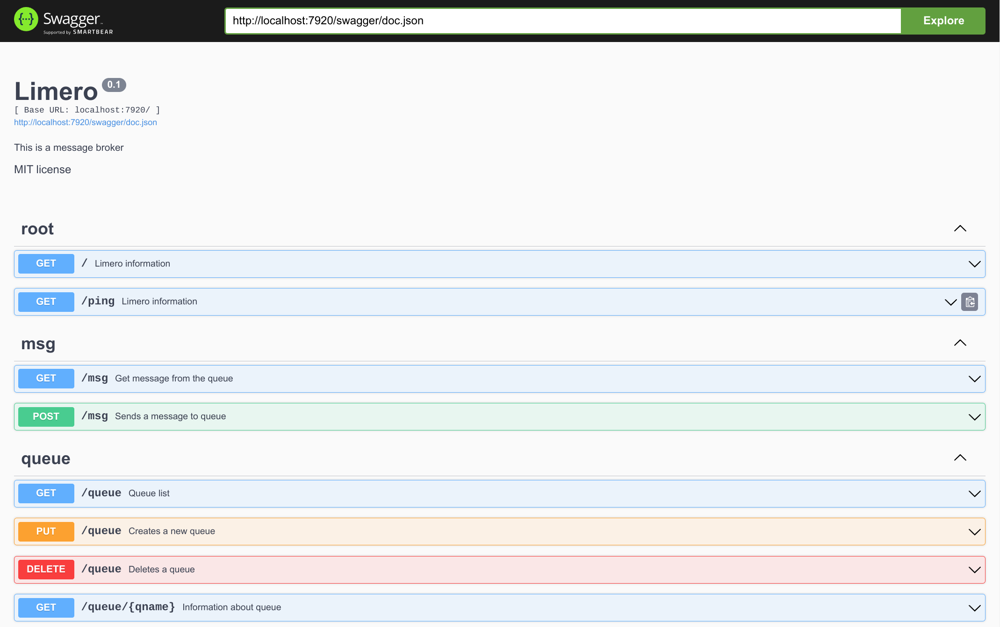

<h1 align="center"> Limero
<p align="center"> 


## 👋 Welcome to Limero!
Limero is a [CouchDB](https://github.com/apache/couchdb)-like message broker. You can create and delete queues, send and receive messages using HTTP requests. Everything is simple and fast. You can just relax 🛋️

## ⚙️ Installation
Clone repository and go to the project folder
```shell
git clone https://github.com/sotchenkov/limero
cd limero
```
You can use the docker container:
```shell
docker build -t limero .
docker run -p 7920:7920 -d limero
```
Or run it using Go:
```shell
go mod download
go run ./cmd/limero/main.go
```
Or pull and run from the Docker Hub:
```shell
docker run -p 7920:7920 -d lexso/limero
```
Limero is now ready to use ✨

## 🌀 Quick start
First, create a queue:
```shell
curl -LX PUT "http://127.0.0.1:7920/queue?name=helloworld" 

{
	"ok": true,
	"info": "The queue has been created",
	"name": "helloworld",
	"presize": 1
}  
```
Now you can send a message to the queue:

```shell
curl --request POST \
     --url 'http://localhost:7920/msg?qname=helloworld' \
     --header 'Content-Type: application/json' \
     --data '{"value": "this is a new message!"}'

{"ok":true}⏎  
```
> The key for messages is always "value"

And now we will receive a message from the queue:
```shell
curl -LX GET "http://127.0.0.1:7920/msg?qname=helloworld"

{"value":"this is a new message!"}⏎
```
## 📃 Docs
To view all the documentation, open the address under the "docs" key in the browser:
```shell
curl -LX GET "http://127.0.0.1:7920/"

{
	"limero": "Welcome!",
	"version": "0.1",
	"license": "MIT license",
	"author": "Alexey Sotchenkov",
	"docs": "localhost:7920/swagger/"
} 
```
By opening the url in the browser, you can view the full swagger documentation




## 🌟 Tips
You can allocate the queue size in advance if you know the average number of messages that will be in the queue. This will increase the queue performance ⚡
```shell
curl -LX PUT "http://127.0.0.1:7920/queue?name=helloworld&size=100" 

{
	"ok": true,
	"info": "The queue has been created",
	"name": "helloworld",
	"presize": 100
}  
```

## 👥 Contribution

Limero is an MIT licensed open source project. The fastest way to get something fixed is to open a PR.

I will be glad of your help 💙